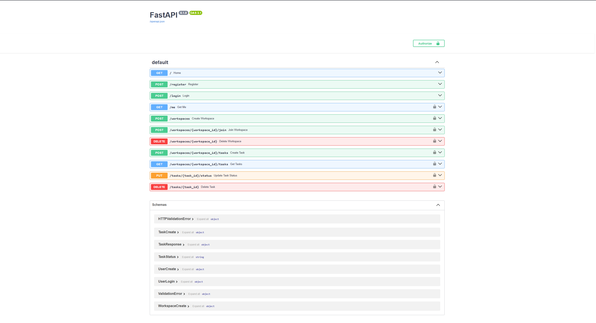

# 🚀 Collaborative Workspace Backend

A **scalable backend for a collaborative workspace platform (Slack / Notion lite)** built using **FastAPI, PostgreSQL, SQLAlchemy, Redis and JWT authentication**.

This project demonstrates how modern backend systems manage **authentication, multi-user collaboration, workspaces, tasks, and real-time updates**.

The backend is designed using a **progressive engineering approach**, where features are implemented step-by-step like in a real startup backend.

---

# 🧠 Engineering Roadmap

This project was built in **7 checkpoints**, each representing a real engineering milestone.

---

## ✅ Checkpoint 1 — Server + Database

**Goal:** Backend server running with database connectivity.

### Implemented

* FastAPI application
* PostgreSQL database connection
* SQLAlchemy ORM models
* Automatic table creation

### Database Tables

* `users`
* `workspaces`
* `workspace_members`

### Result

Database connected and schema created successfully.


---

## ✅ Checkpoint 2 — Authentication System

**Goal:** Secure user authentication.

### Implemented

* User registration
* User login
* Password hashing
* JWT token generation
* Protected API routes

### Result

Users must authenticate before accessing protected endpoints.


---

## ✅ Checkpoint 3 — Workspace Logic

**Goal:** Multi-user collaboration.

### Implemented

* Create workspace
* Join workspace
* Workspace membership system
* Role management

Roles supported:

* **Admin**
* **Member**

### Security

* Permission checks
* Workspace access validation

### Result

Multiple users can collaborate inside workspaces.


---

## ✅ Checkpoint 4 — Tasks Module

**Goal:** Introduce real product functionality.

### Implemented

* Create tasks
* Assign tasks to users
* Update task status
* Pagination support

### Result

Backend now supports real collaborative workflows.


---

## ✅ Checkpoint 5 — Real Engineering

**Goal:** Build a more robust backend.

### Implemented

* Duplicate protection
* Database transactions
* Structured error handling
* Request validation

### Result

System becomes more **stable and production-aware**.


---

## ✅ Checkpoint 6 — Production Features

**Goal:** Introduce startup-ready capabilities.

### Implemented

* Redis caching
* Background jobs
* Email invitations
* Activity logging

### Result

Backend becomes suitable for **production workloads**.


---

## ✅ Checkpoint 7 — Advanced Engineering

**Goal:** Make the project stand out.

### Implemented

* WebSocket real-time updates
* Docker containerization
* Rate limiting
* Scalable architecture

### Result

Backend behaves like a **real-time collaborative platform**.


---

# 🏗 Tech Stack

| Technology | Purpose                        |
| ---------- | ------------------------------ |
| FastAPI    | High-performance API framework |
| PostgreSQL | Relational database            |
| SQLAlchemy | ORM                            |
| Redis      | Caching & background tasks     |
| JWT        | Authentication                 |
| Uvicorn    | ASGI server                    |
| WebSockets | Real-time communication        |

---

# 📂 Project Structure

```
app
│
├── core
│   ├── auth.py
│   ├── security.py
│   └── cache.py
│
├── models
│   ├── user.py
│   ├── workspace.py
│   ├── membership.py
│   └── task.py
│
├── schemas
│   ├── user.py
│   ├── workspace.py
│   └── task.py
│
├── db.py
└── main.py
```

---

# ⚙️ Installation

Clone the repository

```bash
git clone https://github.com/shrajal01/collaborative-workspace-backend.git
cd collaborative-workspace-backend
```

Create virtual environment

```bash
python -m venv venv
```

Activate environment

Windows

```bash
venv\Scripts\activate
```

Install dependencies

```bash
pip install -r requirements.txt
```

---

# ▶️ Run the Server

```bash
uvicorn app.main:app --reload
```

Server runs at

```
http://127.0.0.1:8000
```

---

# 📘 API Documentation

FastAPI automatically generates interactive API documentation.

Swagger UI available at:

```
http://127.0.0.1:8000/docs
```

---

# 📸 Swagger API Preview



---

# 🔮 Future Improvements

* Notification system
* Search functionality
* Task comments
* File uploads
* Advanced analytics

---

# 👨‍💻 Author

**Shrajal**

GitHub
https://github.com/shrajal01
